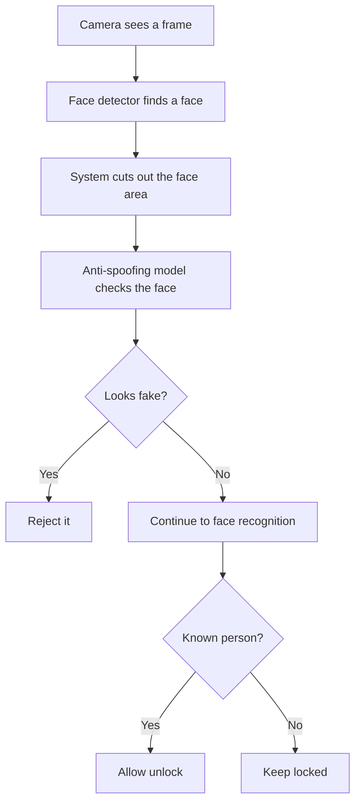

# Anti-Spoofing MobileNetV2, Explained in Plain English

Date: 2026-06-04

This document explains only the anti-spoofing model part of Arclight. It does not explain the full attendance system, the full face recognition model, the database, or the door lock wiring unless those parts directly touch anti-spoofing.

## Short Version

The anti-spoofing model is a safety checker.

Its job is to answer this question:

> Is the face in front of the camera probably a real live face, or is it probably a fake face shown through a photo, phone screen, printed picture, or similar trick?

If the model thinks the face is real, the system continues to face recognition.

If the model thinks the face is fake, the system rejects it and does not continue to face recognition.

For a door lock, this matters because face recognition alone can sometimes answer the wrong question. Face recognition asks, "Who does this face look like?" Anti-spoofing asks, "Should we trust this face image at all?"

Source files:

- Anti-spoofing code: `anti_spoofing.py`
- Server code that uses it: `arclight_server.py`
- Model file: `models/anti_spoof_model/best.tflite`
- Model explanation file: `models/anti_spoof_model/metadata.json`
- Model labels: `models/anti_spoof_model/labels.txt`

## What "Spoofing" Means Here

In this project, spoofing means trying to fool the camera with something that is not a real live face.

Examples:

- A printed face photo
- A face shown on a phone
- A face shown on a laptop screen
- A replayed video
- Any face-like image that should not be trusted as a real person standing there

The anti-spoofing model is not trying to identify the person. It is trying to decide whether the face image should be trusted before identity checking happens.

## Why This Model Exists

Arclight appears to be a face-recognition door access system.

Without anti-spoofing, the system might see a photo of an enrolled person and think, "This looks like Alice." That could be dangerous if the system unlocks the door.

With anti-spoofing, the system first asks, "Does this look like a real live face?" If the answer is no, the system does not continue to identity recognition.

That means the anti-spoofing model is a first safety gate.

The intended order is:

1. Camera sees a face.
2. Anti-spoofing checks whether the face looks real.
3. If it looks fake, reject it.
4. If it looks real, then face recognition checks who it is.
5. If the person is known, the door can unlock.

Source: `arclight_server.py:273-302`

## What MobileNetV2 Is

MobileNetV2 is the type of image model used as the base of this anti-spoofing model.

Plain English version:

MobileNetV2 is a small and efficient image-reading brain made for devices that do not have a lot of computing power.

It was created for phones, small computers, and edge devices. A Raspberry Pi door lock system fits that kind of use case because it needs to make decisions locally and quickly without a big GPU.

Why it was created:

- Big image models can be slow.
- Big image models can need too much memory.
- Small devices need models that are fast enough to run in real time.
- MobileNetV2 was designed to keep useful image understanding while using less compute.

In this project, MobileNetV2 is used like the model's eyes. It looks at the face crop and finds image patterns. Then the anti-spoofing part decides whether the face looks real or fake.

External references:

- MobileNetV2 paper: https://arxiv.org/abs/1801.04381
- TensorFlow MobileNetV2 documentation: https://www.tensorflow.org/api_docs/python/tf/keras/applications/MobileNetV2

## Why MobileNetV2 Makes Sense for Arclight

Arclight is set up for Raspberry Pi use. The setup notes install Raspberry Pi packages and `tflite-runtime`, which is a lightweight way to run TensorFlow Lite models. Source: `requirements.txt:1-14`, `requirements.txt:27-38`

That matters because a Raspberry Pi is much smaller than a desktop workstation.

MobileNetV2 makes sense because:

- It is designed for small devices.
- It is faster than many larger image models.
- It can run as a TensorFlow Lite model.
- The deployed model file is only about 2.5 MB.
- It is enough for a yes/no task like "real face or spoof face?"

The model file itself contains internal names that include `mobilenetv2_antispoof_strict_1`, which supports that this is a MobileNetV2-based anti-spoofing model.

Source: `models/anti_spoof_model/best.tflite` binary inspection

## The Main Pieces

### `anti_spoofing.py`

This is the Python wrapper around the anti-spoofing model.

Plain English:

This file is the helper that knows how to prepare a face image, send it into the model, read the model's answer, and return a simple decision.

It does these jobs:

- Finds the model file.
- Reads the model settings.
- Loads the TensorFlow Lite model.
- Crops the face from the camera image.
- Resizes the face to the size the model expects.
- Converts the image into the right color and number format.
- Gets a spoof score from the model.
- Decides whether the face is real or spoof.
- Fails safely if something goes wrong.

### `models/anti_spoof_model/best.tflite`

This is the actual trained model file.

Plain English:

This is the saved anti-spoofing brain. The Python code loads this file and asks it to judge face crops.

### `models/anti_spoof_model/metadata.json`

This is the instruction sheet for the model.

Plain English:

This file explains how the model should be used. It says the model is for face anti-spoofing, what labels mean, what image size it expects, and what score should count as fake.

Important settings:

- Task: face anti-spoofing binary classifier. Source: `metadata.json:2`
- Real face label: `real`. Source: `metadata.json:3-9`
- Fake face label: `spoof`. Source: `metadata.json:3-9`
- Score meaning: higher score means more likely spoof. Source: `metadata.json:11`
- Threshold: `0.5`. Source: `metadata.json:16-17`
- Input size: `224 x 224 x 3`. Source: `metadata.json:19-23`
- Pixel scaling: divide by `255`. Source: `metadata.json:24`

### `models/anti_spoof_model/labels.txt`

This is a small label list.

It says:

- `0` means `real`
- `1` means `spoof`

Source: `models/anti_spoof_model/labels.txt:1-2`

### `arclight_server.py`

This is where the anti-spoofing model is used by the running app.

Plain English:

The server loads the anti-spoofing model when the app starts. Then, during the camera flow, it checks every detected face before face recognition is allowed to continue.

Source: `arclight_server.py:115-123`, `arclight_server.py:273-283`

## The Full Flow in Plain English

The important point:

Face recognition only happens after anti-spoofing passes.

Source: `arclight_server.py:273-283`

## What Happens When the App Starts

When the FastAPI app starts, it loads the anti-spoofing model.

Plain English:

The system says, "Before I run the camera and recognition system, I need to load my fake-face detector."

The server does this:

1. Prints that it is loading the anti-spoof model.
2. Creates an `AntiSpoofClassifier`.
3. If loading works, it prints the threshold.
4. If loading fails, it prints the error.
5. Then it loads the face recognition system.

Source: `arclight_server.py:115-128`

Why this matters:

The anti-spoofing model is treated as a required safety piece.

## What Happens When the Camera Starts

The camera start endpoint checks if anti-spoofing is ready.

Plain English:

Before opening the camera workflow, the server asks, "Is the fake-face detector ready?"

If it is not ready, the server returns an error instead of starting the camera.

Source: `arclight_server.py:377-388`

This is a good safety behavior. It helps avoid running the door access flow without the anti-spoofing check.

## What Happens in Every Camera Frame

For every frame from the camera, the system does this:

1. Reads the camera image.
2. Finds faces in the image.
3. For each face, gets the face box.
4. Sends the face box and image to the anti-spoofing model.
5. If the model says spoof, the system draws a red box and skips recognition.
6. If the model says real, the system continues to face recognition.
7. If the real face belongs to a known person, the lock can open.
8. If there is no known real face, the lock stays closed.

Source: `arclight_server.py:258-314`

Plain English summary:

The model stands between the camera and the unlock decision. A fake-looking face does not get to the identity-checking step.

## What Happens During Enrollment

Enrollment means adding or updating a person's saved face.

The anti-spoofing model is used here too.

Plain English:

The system does not want someone to enroll a photo or phone screen as a trusted face. So before it saves a face sample, it checks whether the face looks real.

During enrollment:

1. The system finds a face.
2. It checks the face with the anti-spoofing model.
3. If the face looks fake, it rejects that capture.
4. If the face looks real, it saves the face data for enrollment.

Source: `arclight_server.py:316-335`

If a spoof is rejected, the enrollment message says:

`Spoof rejected (...). Use a real face.`

Source: `arclight_server.py:326-329`

## The Result Object, Explained Simply

The code has a small result object named `AntiSpoofResult`.

Source: `anti_spoofing.py:11-19`

It is like a checklist answer from the model.

| Field | Plain meaning |
| --- | --- |
| `ready` | Was the anti-spoofing checker available? |
| `is_real` | Did the face pass as real? |
| `is_spoof` | Did the face fail as fake/spoof? |
| `spoof_score` | How fake the model thinks the face looks. Higher means more suspicious. |
| `threshold` | The cutoff score used to make the decision. |
| `label` | The simple word result: `real` or `spoof`. |
| `error` | What went wrong, if something failed. |

## How the Model Is Loaded

The class `AntiSpoofClassifier` prepares the anti-spoofing model.

Source: `anti_spoofing.py:23-59`

Plain English:

This is the setup worker. It finds the model file, reads the instruction sheet, starts the model runtime, and marks itself ready only if everything works.

What it expects:

- Model folder: passed in by the server.
- Model file name: `best.tflite`.
- Metadata file name: `metadata.json`.
- Default image size: `224 x 224`.
- Default decision threshold: `0.5`.
- Default face crop margin: `0.25`.

Source: `anti_spoofing.py:29-40`

If setup fails, it does not pretend everything is fine. It stores the error and marks the model as not ready.

Source: `anti_spoofing.py:57-59`

## What the Threshold Means

The threshold is the decision line.

The model gives one score called `spoof_score`.

- If the score is below `0.5`, the face is treated as real.
- If the score is `0.5` or higher, the face is treated as spoof.

Source: `anti_spoofing.py:131-139`, `metadata.json:12-17`

Plain English example:

| Spoof score | Threshold | Decision |
| --- | --- | --- |
| `0.20` | `0.50` | Real enough to continue |
| `0.49` | `0.50` | Real enough to continue |
| `0.50` | `0.50` | Reject as spoof |
| `0.80` | `0.50` | Reject as spoof |

The threshold can be changed in two ways:

- Pass a threshold directly when creating the classifier.
- Set the `ANTI_SPOOF_THRESHOLD` environment variable.

Source: `anti_spoofing.py:80-86`

Plain English:

The project can make the model stricter or more forgiving without rewriting the main logic.

## How the Face Is Cropped

The model does not look at the whole camera frame.

It looks at the detected face area.

Source: `anti_spoofing.py:152-171`

Plain English steps:

1. The face detector gives a box around the face.
2. The code checks that the box is valid.
3. The code adds extra space around the face.
4. The code makes sure the crop does not go outside the camera image.
5. The code cuts out that face area.

The extra space is called the crop margin. In this project, it is `0.25`, meaning the crop includes some area around the face.

Source: `metadata.json:48-53`, `anti_spoofing.py:163-171`

Why include extra area?

Because spoof clues may appear around the face, such as a phone edge, paper border, screen glare, or unnatural background close to the face.

That is an explanation of why the choice is useful. The code itself only confirms that it adds the margin.

## How the Face Image Is Prepared

The cropped face has to be changed into the exact format the model expects.

Source: `anti_spoofing.py:173-179`

Plain English steps:

1. Resize the face to `224 x 224` pixels.
2. Change the color order from OpenCV's format to normal RGB.
3. Convert pixel numbers from `0..255` into `0..1`.
4. Add a wrapper dimension so the model sees it as one image.
5. Match the number type expected by the model runtime.

Plain English example:

- A normal image pixel might have values like `128, 80, 200`.
- The model wants smaller decimal values, so the code divides by `255`.
- That turns the numbers into values between `0` and `1`.

Why this matters:

Models are trained with images in a specific format. If the running app sends images in a different format, the model may give bad answers.

## How Prediction Works

The method named `predict` is the main decision maker.

Source: `anti_spoofing.py:118-150`

Plain English version:

1. Check if the model is ready.
2. Crop the face.
3. Prepare the face image.
4. Send it into the model.
5. Read the model's score.
6. Compare the score to the threshold.
7. Return `real` or `spoof`.

The key line of behavior:

- `spoof_score >= threshold` means reject.
- `spoof_score < threshold` means continue.

Source: `anti_spoofing.py:131-139`

## What "Fail Closed" Means

This project fails closed.

Plain English:

If something goes wrong, the system chooses the safer answer: reject the face.

Examples:

- Model is not ready.
- Model file cannot be loaded.
- Face crop is invalid.
- Prediction crashes.

In those cases, the result is treated as spoof.

Source: `anti_spoofing.py:107-116`, `anti_spoofing.py:141-150`

Why this matters:

For a door lock, it is usually safer to accidentally reject a real person than to accidentally allow a fake face.

The metadata says the same idea: for door locks, reducing spoof acceptance is more important than avoiding every false rejection.

Source: `models/anti_spoof_model/metadata.json:18`

## What the Metadata Says About Training

The repository includes some training notes in `metadata.json`.

Plain English summary:

- The model was trained for a real-vs-spoof task.
- It used a threshold chosen for safer door-lock behavior.
- Spoof examples were given extra importance during training.
- The model expects 224 by 224 color images.
- The original dataset paths were from a `/content/...` environment, likely a notebook or Colab-style training setup.

Source: `models/anti_spoof_model/metadata.json:25-47`

Important limitation:

The repository does not include the full training code, original dataset, validation report, or confusion matrix.

That means we can explain how the model is used in this app, but we cannot fully prove how well it performs against real-world spoof attacks from the repository alone.

## What Is Confirmed by the Code

These points are directly supported by the source code and model files:

- The anti-spoofing model is loaded from `models/anti_spoof_model`. Source: `arclight_server.py:30-32`
- The model file is expected to be `best.tflite`. Source: `anti_spoofing.py:30`
- The metadata file is expected to be `metadata.json`. Source: `anti_spoofing.py:31`
- The threshold defaults to `0.5`. Source: `anti_spoofing.py:34`, `metadata.json:16-17`
- The model checks a cropped face, not the entire frame. Source: `anti_spoofing.py:123`, `anti_spoofing.py:152-171`
- The face image is resized to `224 x 224`. Source: `anti_spoofing.py:173-175`
- The image is converted from BGR to RGB. Source: `anti_spoofing.py:176`
- Pixel values are divided by `255`. Source: `anti_spoofing.py:177`
- A high score means spoof. Source: `anti_spoofing.py:131-139`
- Spoof faces do not continue to recognition. Source: `arclight_server.py:274-283`
- Spoof faces are rejected during enrollment. Source: `arclight_server.py:325-329`
- If prediction fails, the code treats the face as spoof. Source: `anti_spoofing.py:141-150`

## What Is Inferred

These points are reasonable conclusions, but the repository does not prove them completely:

- MobileNetV2 was likely chosen because Arclight targets Raspberry Pi and needs a small fast model.
- The anti-spoofing model was likely trained outside this repository, because only the finished `.tflite` file and metadata are present.
- The model is intended to reduce photo/screen attacks, but the repository does not include attack test results.

## Strengths in Plain English

1. The system checks liveness before identity.

   This is the right order for a door lock. A fake face should not even reach the "who is this?" step.

2. The system fails safely.

   If the model breaks, the system rejects instead of trusting the face.

3. The model settings are stored beside the model.

   The metadata file explains the threshold, input size, labels, and training notes.

4. Enrollment is protected too.

   The same anti-spoofing check is used when adding a new face, not only when unlocking.

5. The model is small.

   A smaller model is more practical for Raspberry Pi deployment.

## Risks and Gaps in Plain English

1. The training proof is missing.

   We can see the final model, but not the full training recipe or test report.

2. The setup check may be inconsistent.

   The Raspberry Pi requirements install `tflite-runtime`, but the final check command imports TensorFlow. That may confuse setup because TensorFlow is not listed in the generated Pi requirements.

   Source: `requirements.txt:27-45`

3. The model's input type should be checked on the real Raspberry Pi.

   The code is written for a model that accepts scaled decimal image values. If a future model uses a different input format, preprocessing may need to change.

4. The metadata should say `MobileNetV2` directly.

   The model file contains MobileNetV2 names, but `metadata.json` does not clearly list the architecture.

5. Spoof attempts are not clearly logged.

   The camera view shows spoof rejection visually, but the attendance log path is reached only after liveness passes.

6. Multiple faces need a clear rule.

   Right now, if one face is spoof but another face is a known real person, the known real person can still trigger unlock. The team should decide if that is acceptable.

7. The UI could explain anti-spoof status better.

   The server exposes anti-spoof status, but the UI does not appear to show a dedicated "anti-spoof ready" indicator.

## Recommended Next Steps in Plain English

1. Add more model history.

   Add the model architecture, training script, dataset version, validation results, and chosen threshold reason into `metadata.json`.

2. Fix the Raspberry Pi setup check.

   Make the check confirm `tflite-runtime` if that is what the Pi installation uses.

3. Test on the actual Raspberry Pi.

   Confirm that the model loads, reads the right input shape, and can run one sample prediction.

4. Decide the strictness rule for multiple faces.

   Choose whether one spoof face in the frame should block unlocking completely.

5. Add spoof attempt logging.

   Log spoof score and timestamp so operators can review suspicious attempts.

6. Add a clear UI status.

   Show whether anti-spoofing is ready, unavailable, or misconfigured.

## One-Sentence Stakeholder Explanation

The MobileNetV2 anti-spoofing model is a lightweight safety checker that runs before face recognition so the door system can reject fake face attempts, such as photos or screens, before they have a chance to unlock anything.

## Verification Notes

This layman version was created from the source-grounded audit in `docs/anti-spoofing-mobilenetv2-audit.md` and the repository files listed above.

Important limitation:

The current Windows environment could not load the real TensorFlow Lite interpreter, so real hardware verification should still be done on the target Raspberry Pi.
